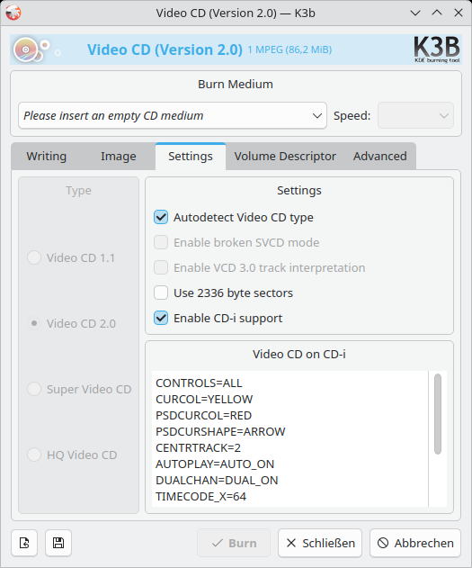

# Authoring of Video-CDs

Tools like `k3b` are able to author Video-CDs. By the time of writing, the included binaries
of the CD-i bridge application are broken in the Debian packaged version of `k3b`.
Nonetheless, you can use it to create a project file for `vcdxbuild` which is the actual backend tool for creating the Video-CD image.

## Fixing the CD-i bridge of k3b

At least on Debian, the binary files inside the `k3b-data` package are broken.
Source them from [somewhere else](https://www.icdia.co.uk/sw_app/index.html) for replacement.

Replace these files on your system with the content from the [vcd_on_cdi_411.zip](https://www.icdia.co.uk/sw_app/vcd_on_cdi_411.zip) archive

    /usr/share/k3b/cdi/cdi_imag.rtf
    /usr/share/k3b/cdi/cdi_text.fnt
    /usr/share/k3b/cdi/cdi_vcd.app
    /usr/share/k3b/cdi/cdi_vcd.cfg
    /usr/share/k3b/cdi/icdia.htm
    /usr/share/k3b/cdi/vcd_on_cdi_41.pdf

To do that on the shell:

    wget http://www.icdia.co.uk/sw_app/vcd_on_cdi_411.zip
    unzip vcd_on_cdi_411.zip
    sudo cp CDI_IMAG.RTF /usr/share/k3b/cdi/cdi_imag.rtf
    sudo cp CDI_TEXT.FNT /usr/share/k3b/cdi/cdi_text.fnt
    sudo cp CDI_VCD.APP /usr/share/k3b/cdi/cdi_vcd.app
    sudo cp icdia.htm /usr/share/k3b/cdi/icdia.htm
    sudo cp vcd_on_cdi_41.pdf /usr/share/k3b/cdi/vcd_on_cdi_41.pdf

## Example with k3b

Open `k3b` and create a new Video CD

Drag & Drop the compatible MPEG files into the project. When done, press `Burn`. Another dialog will open.
Go to the `Settings` tab and ensure that `Video CD 2.0` is selected. Also ensure that CD-i support is enabled. Without this, the disc will not start on a Philips CD-i.

The VCD can now be burned to disc or written to an image. Since there is a certain margin for errors when authoring a VCD, I suggest creating only the image now, checking it with [cdiemu](cdiemu.md) and burn it afterwards.

## Authoring on console

Under the hood of `k3b`, `vcdxbuild` is used. Since a configuration file is required, use tools like `k3b` to create it. Usually a VideoCD can be created just with this console tool. 
For fine tuning or faster iterations with changed video files, the configuration can be exported and the tool can be called from shell:

    vcdxbuild --cue-file=videocd.cue --bin-file=videocd.bin example/vcd.xml

